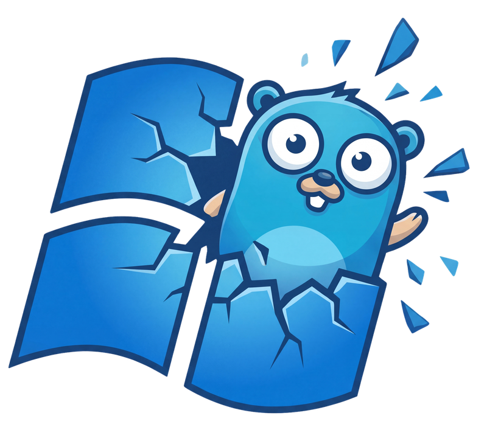

<div align="center">
  

  # WinGopher
  **Parallel Windows App Installer**

  [](https://go.dev/)
  [](https://wails.io/)
  [](LICENSE)
  [](https://www.microsoft.com/windows)

  A simple GUI for the Windows Package Manager (winget).
</div>

---

## 🚀 Quick Start (One-liner)

Run the following command in **PowerShell** (as Administrator) to instantly download and launch WinGopher:

```powershell
iwr -useb https://raw.githubusercontent.com/fereshetyan/wingopher/main/install.ps1 | iex
```

---

## ✨ Features

### 📦 Core Functionality
- **Parallel Installations**: Install multiple apps simultaneously with configurable concurrency (default: 3).
- **Winget Integration**: Full interaction with Windows Package Manager CLI.
- **Batch Operations**: Select and install multiple apps at once.
- **Uninstall Support**: Remove installed applications directly from the interface.
- **Update Support**: Update installed applications directly from the interface.
- **Real-time Log Streaming**: Live CLI output display during installations and uninstalls.

### 🛠 Technical Features
- **Single Binary**: Fully portable executable with all assets embedded via Go embed.
- **Admin Detection**: Warning prompts when running without elevated privileges.
- **Winget Verification**: Checks winget availability on startup.
- **Optimistic UI Updates**: Immediate feedback with background verification.
- **Silent Execution**: Hidden command windows during winget operations.

---

## 📂 Project Structure

- `internal/app`: Wails application handlers and lifecycle events.
- `internal/installer`: Winget CLI interaction and log parsing.
- `internal/models`: Domain data structures.
- `internal/repository`: Data management and `apps.json` loading.
- `frontend/src`: React/TS UI components and hooks.

---

## 🏁 Prerequisites

- **Windows 10/11** with [Winget](https://learn.microsoft.com/en-us/windows/package-manager/) installed.
- [Go 1.23+](https://go.dev/dl/) (for development).
- [Node.js](https://nodejs.org/) (for development).
- [Wails CLI](https://wails.io/docs/gettingstarted/installation) (for development).

---

## 🔨 Development

```bash
# Install Wails CLI
go install github.com/wailsapp/wails/v2/cmd/wails@latest

# Run with hot-reload
wails dev

# Build production executable
wails build -platform windows/amd64 -ldflags "-s -w"
```

---

## 📄 License

MIT
